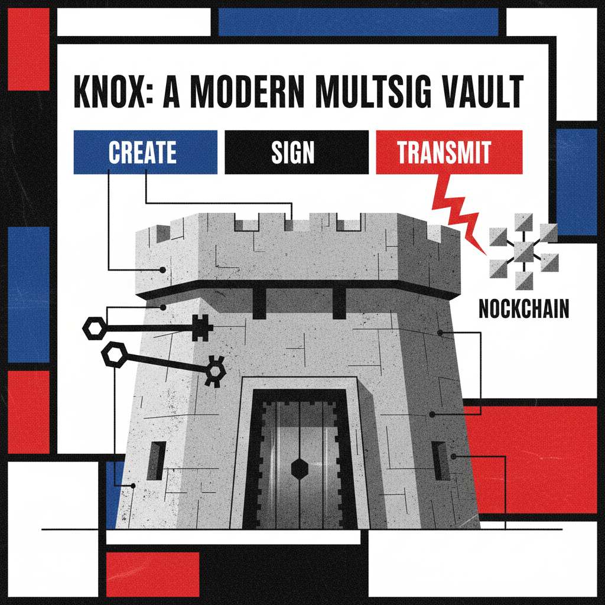
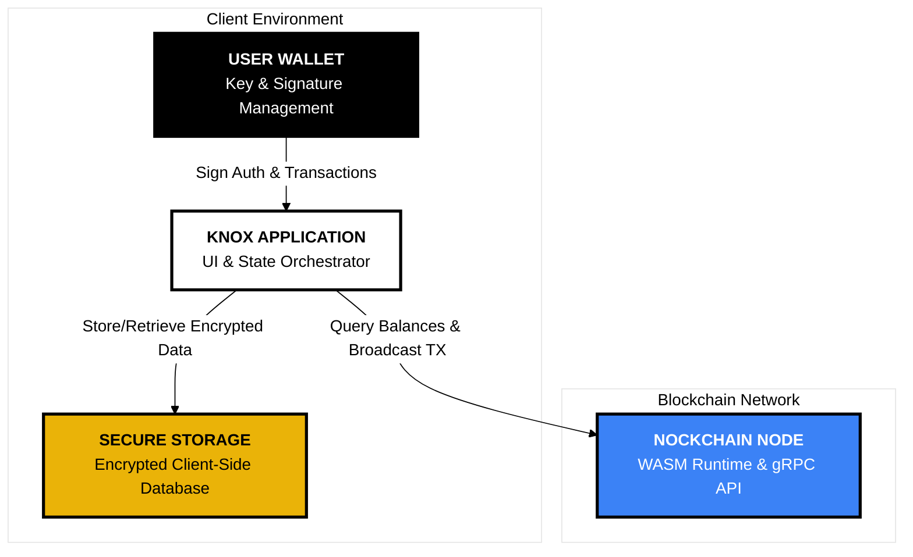
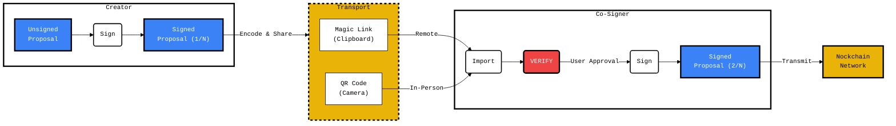

# KNOX: A Modern Multisig Vault for Nockchain

**KNOX is a secure, intuitive, and entirely client-side web application for managing Nockchain multisig vaults. It provides a seamless experience for creating shared vaults, proposing transactions, and coordinating signatures without ever trusting a central server.**

Inspired by the principles of Neoplasticism, KNOX's design and architecture are reduced to their essential components, creating a clear, harmonious, and secure user experience.

<p align="center">
  
  <br>
  <em>Multiple keys (signers) combine to form a single, secure vault.</em>
</p>

## Architectural Philosophy

The foundational architectural decision for KNOX was to build a purely client-side application. While many production multisig solutions utilize backends for indexing and real-time coordination, the client-side-only constraint was deliberately chosen for this implementation to prove out the most critical, non-negotiable security guarantees of a decentralized system.

This approach forces a focus on solving the hardest problems first:
*   **Zero-Trust Security:** By eliminating a proprietary backend, we remove any need for a user to trust a third-party server. The entire security model rests on verifiable, client-side cryptography.
*   **Absolute User Control:** All user data is encrypted and stored locally on the user's own machine, protected by a key derived directly from their wallet. The user, and only the user, holds the keys.
*   **Core Logic Mastery:** This architecture demonstrates that a robust, secure, and intuitive multisig experience—from transaction construction to peer-to-peer signature coordination—is achievable while adhering to the strongest principles of decentralization.

---

## System Architecture

The architecture is a clean composition of four distinct, interacting components. This design separates the core application logic from the underlying blockchain and wallet infrastructure, ensuring modularity and security.


<p align="center"><em>The four core architectural components and their interactions.</em></p>

---

## The Multisig Workflow

The user journey is designed to be simple, guided, and secure.

### Onboarding & Session Management
- **Initial Setup**
  A new user creates their first vault, which initializes an encrypted database on their local machine.
- **Session Unlock**
  A returning user is presented with a locked screen. They must sign a message with their Iris Wallet to derive a session key and decrypt their vaults into memory.

### The Transaction Lifecycle
From proposal to transmission, every step is designed for clarity and security. The core of this flow is the **Proposal Engine**, which facilitates peer-to-peer sharing of the transaction state.


<p align="center"><em>The Proposal Engine: A secure, peer-to-peer coordination flow.</em><br></p>

The most critical security feature of this workflow is the **VERIFY** step. The receiving client **always** reconstructs the human-readable transaction summary from the raw, decoded transaction bytes. This guarantees that *what you see is what you sign*, neutralizing potential phishing or man-in-the-middle attacks.

---

## Engineering Solutions & Insights

Building this application required solving several non-trivial challenges inherent to secure, client-side Web3 development.

- **End-to-End Testing in a Sandboxed Environment (The Faucet Problem)**
  A primary challenge for Nockchain development is the absence of a public faucet for its testnet, making it impossible for third-party developers to acquire `NOCK` tokens for testing. To overcome this, a complete, containerized local fakenet was engineered. After investigating existing community solutions and identifying several root causes for their instability (including coinbase maturity locks, wallet state desynchronization, and incompatible CLI tool versions), a custom, single-container solution was developed. This new architecture pins the `nockchain` build to a specific, stable commit where the CLI tools are compatible, finally allowing for the creation of a robust, automated faucet script. This rigorous debugging journey resulted in a reliable, sandboxed environment for true end-to-end testing.

- **Robust Wallet SDK Integration**
  The asynchronous nature of wallet SDKs can lead to race conditions. This was solved by implementing a reactive, `useEffect`-based flow that listens for state changes from the wallet, ensuring UI transitions are reliable. Additionally, a robust error parser was built into the wallet store to gracefully handle non-standard error objects from user-rejected requests.

- **WASM Memory Management**
  Interacting with the Rust-compiled WASM module required careful memory management. "Null pointer" errors were traced to incorrect handling of Rust's ownership model. The solution was to ensure that only the final, top-level WASM objects in a construction chain are explicitly freed (`.free()`), as the memory of intermediate objects is moved, not copied.

---

## Roadmap to a Production-Grade Solution

The current client-side architecture provides a powerful, secure foundation. To evolve KNOX into a full-featured, production-grade application that rivals industry leaders like Gnosis Safe, the following architectural enhancements would be the logical next steps.

### Real-Time Coordination via an Untrusted Relay
Production solutions offer a seamless, real-time signing experience. This can be achieved without sacrificing our security model by introducing a simple, untrusted WebSocket relay. The implementation involves end-to-end encrypting the proposal on the client-side before sending it to a public relay (e.g., a Nostr relay). Co-signers' apps receive the ciphertext and decrypt it locally, providing a live, collaborative user experience without ever compromising the core security principle that the central server is untrusted.

### On-Chain Indexing for Transaction History
A key feature of production wallets is a reliable and complete transaction history. Relying solely on a node's gRPC endpoint for this is inefficient. The implementation requires a backend indexer service (similar to The Graph for Ethereum) to monitor the Nockchain, parse all transactions related to KNOX vaults, and store them in a query-optimized database. This provides users with instant, reliable access to their full transaction history, allowing the frontend to remain a "light client."

### Address Book & Human-Readable Names
To improve usability and reduce the risk of address-pasting errors, an encrypted, cloud-synchronized address book is essential. The implementation would allow users to save frequently used addresses with human-readable names (e.g., "Treasury," "Alice's Wallet"). This address book would be encrypted and stored locally, with an option to synchronize the encrypted blob via a simple key-value cloud store for multi-device support.

---

## Local Development

You can run the KNOX frontend for UI development or the entire stack for end-to-end testing. Both local and Docker-based workflows are provided.

### Prerequisites

- [Node.js](https://nodejs.org/) (version `v20.x` or higher, for local dev only)
- [pnpm](https://pnpm.io/) (for local dev only)
- Docker & Docker Compose

### Option 1: Running the Frontend Only (for UI Development)

This method starts a Vite development server with hot-reloading.

#### Local Machine Workflow (Requires Node/pnpm)
1.  **Install dependencies:** `pnpm install`
2.  **Run the dev server:** `pnpm dev`
3.  Access the app at `http://localhost:5173`.

#### Docker Workflow (No Local Node/pnpm needed)
This command starts the Vite dev server inside a Docker container.
1.  **Run the dev-stack:**
    ```bash
    docker-compose -f ./docker-compose.dev.yml up --build
    ```
2.  Access the app at `http://localhost:5173`. Changes to your source code will trigger an instant reload in the browser.

### Option 2: Running the Full Stack (Frontend + Local Nockchain Node)

This single command builds the stable Nockchain container, builds the production frontend, and starts all services for end-to-end testing. **The first build will take 30-60 minutes.**

1.  **Start all services:**
    From your project's root directory, run:
    ```bash
    docker-compose -f ./docker-compose.yml up --build -d
    ```
    Wait for the `nockchain-miner` container's status to show `(healthy)`. This can take several minutes.

#### Access Points
- **KNOX Frontend Application:** `http://localhost:3000`
- **Envoy gRPC-Web Proxy:** `http://localhost:8080`
- **Direct Nockchain gRPC:** `localhost:5555` (for the faucet)

### Funding Your Vault

The local development environment includes an automated faucet script. After starting the Full Stack (Option 2) and creating a vault in the KNOX UI, copy its PKH address.

1.  **Make the script executable:**
    ```bash
    chmod +x ./knox-devnet/docker/faucet.sh
    ```

2.  **Run the script to send 100 NOCK:**
    Replace `<YOUR_VAULT_ADDRESS>` with the PKH from the UI.
    ```bash
    ./knox-devnet/docker/faucet.sh <YOUR_VAULT_ADDRESS>
    ```
---

## License

This project is licensed under the [MIT License](./LICENSE).
