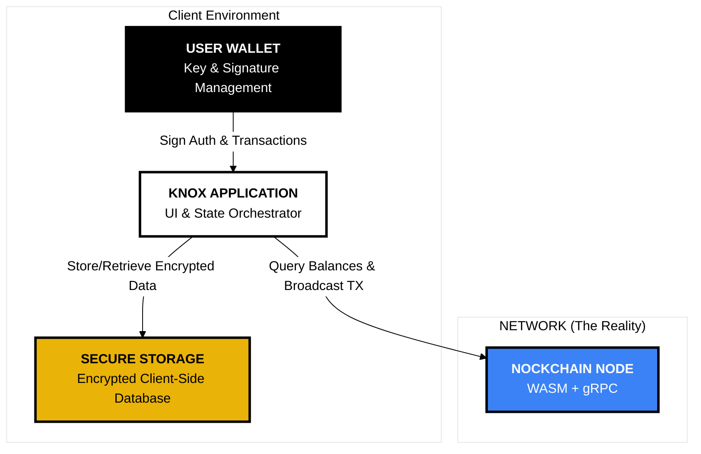
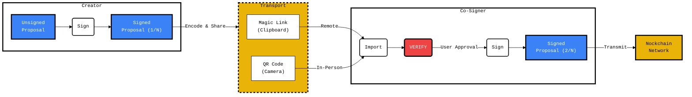

# KNOX: A Modern Multisig Vault for Nockchain

**KNOX is a secure, intuitive, and entirely client-side web application for managing Nockchain multisig vaults. It provides a seamless experience for creating shared vaults, proposing transactions, and coordinating signatures without ever trusting a central server.**

Inspired by the principles of Neoplasticism, KNOX's design and architecture are reduced to their essential components, creating a clear, harmonious, and secure user experience.

<p align="center">
  
  <br>
  <em>Multiple keys (signers) combine to form a single, secure vault.</em>
</p>


## Core Features & Design Decisions

KNOX was architected with a primary emphasis on **Usability and Intuitiveness**, underpinned by non-negotiable **Security** and a robust **Client-Side Architecture**. The core design decisions and the features that emerge from them are detailed below.

### Foundational Principles

*   **Client-Side Sovereignty:** The foundational architectural decision was to build a purely client-side application. While many production multisig solutions utilize backends, this constraint was deliberately chosen to prove out the most critical security guarantees of a decentralized system. This approach forces a focus on zero-trust security and absolute user control, where all data is encrypted and stored locally on the user's own machine.
<br>
*   **Wallet-as-Authenticator Security Model:** The user's Iris Wallet is the root of trust. A cryptographic signature, approved by the user for each session, is used to derive a temporary, in-memory encryption key that protects all locally stored vault data.

### Intuitive User Experience

*   **Guided, Wizard-Based Flows:** Both creating a vault and sending a transaction are handled through multi-step wizards. These flows guide the user, validate input at each step, and prevent them from getting into an invalid state, providing immediate and intuitive feedback.
<br>
*   **The Proposal Engine (Solving Decentralized UX):** The core usability challenge of a backend-less multisig wallet is coordination. This was solved by designing the Proposal Engine, which presents this complex problem to the user in three simple, universally understood formats: a **Magic Link** for easy sharing, a **QR Code** for secure, air-gapped workflows, and a **Text Blob** as a robust fallback.
<br>
*   **"Verify, Don't Trust" as a UX Feature:** Security and usability are intertwined. The application guarantees that every signer is presented with a clear, human-readable summary that is reconstructed from the raw transaction data upon import. This "what you see is what you sign" (WYSIWYS) principle gives users the confidence to approve transactions.

---

## System Architecture

The architecture is a clean composition of four distinct, interacting components. This design separates the core application logic from the underlying blockchain and wallet infrastructure, ensuring modularity and security.


<p align="center"><em>The four core architectural components and their interactions.</em></p>

---

## The Multisig Workflow

The user journey is designed to be simple, guided, and secure.

### Onboarding & Session Management

#### Initial Setup
A new user creates their first vault, which initializes an encrypted database on their local machine.

#### Session Unlock
A returning user is presented with a locked screen. They must sign a message with their Iris Wallet to derive a session key and decrypt their vaults into memory.

### The Transaction Lifecycle
From proposal to transmission, every step is designed for clarity and security, facilitated by the **Proposal Engine**.


<p align="center"><em>The Proposal Engine: A secure, peer-to-peer coordination flow.</em></p>

The most critical security feature of this workflow is the **VERIFY** step. The receiving client **always** reconstructs the human-readable transaction summary from the raw, decoded transaction bytes. This guarantees that *what you see is what you sign*, neutralizing potential phishing or man-in-the-middle attacks.

---

## Engineering Solutions & Insights

Building this application required solving several non-trivial challenges inherent to secure, client-side Web3 development.

- **Sandboxed Testnet Engineering (The Faucet Problem)**
  A primary challenge for Nockchain development is the absence of a public faucet for its testnet, making it impossible for third-party developers to acquire `NOCK` tokens for testing. To overcome this, a complete, containerized local fakenet was engineered. After investigating existing community solutions and identifying several root causes for their instability (including coinbase maturity locks, wallet state desynchronization, and incompatible CLI tool versions), a custom, single-container solution was developed. This new architecture pins the `nockchain` build to a specific, stable commit where the CLI tools are compatible, finally allowing for the creation of a robust, automated faucet script. This rigorous debugging journey resulted in a reliable, sandboxed environment for true end-to-end testing.

- **Robust Wallet SDK Integration**
  The SDK's asynchronous nature required careful management. I solved a critical race condition between `connect()` and `signMessage()` by implementing a user-driven, two-step UI flow ("Connect", then "Sign"). I also built a robust error parser in the `wallet-store` to gracefully handle non-standard error objects from user-rejected signature requests.

- **WASM Memory Management**
  Interacting with the Rust-compiled WASM module required careful memory management. "Null pointer" errors were traced to incorrect handling of Rust's ownership model. The solution was to ensure that only the final, top-level WASM objects in a construction chain are explicitly freed (`.free()`), as the memory of intermediate objects is moved, not copied.

---

## Roadmap to a Production-Grade Solution

The current client-side architecture provides a powerful, secure foundation. To evolve KNOX into a full-featured, production-grade solution that rivals existing platforms, the following architectural enhancements would be the logical next steps.

**Real-Time Coordination via an Untrusted Relay**

The "Magic Link" flow could be upgraded to a real-time, collaborative experience by introducing a simple, untrusted WebSocket relay. In this model, when a user signs a proposal, the app would end-to-end encrypt the proposal data using the public keys of the other co-signers. This ciphertext would be sent to the relay, which blindly broadcasts it to other connected clients. Co-signers' apps would receive the data, decrypt it locally using their wallet, and see the updated proposal in real time. This provides a live user experience without ever compromising the core security principle that the central server is untrusted.

**On-Chain Indexing for Transaction History**

A key feature of production wallets is a reliable and complete transaction history. Relying solely on a node's gRPC endpoint for this is inefficient. The implementation would require a backend indexer service (similar to The Graph for Ethereum) to monitor the Nockchain, parse all transactions related to KNOX vaults, and store them in a query-optimized database. This provides users with instant, reliable access to their full transaction history, allowing the frontend to remain a "light client."

**Encrypted, Zero-Knowledge Address Book & Human-Readable Names**

To improve usability and reduce the risk of address-pasting errors, a secure address book is essential. The implementation would follow a zero-knowledge architecture: the address book (a simple JSON object of names and addresses) is **always encrypted on the client-side** using the user's `sessionKey`. This encrypted blob can then be optionally synchronized using a simple key-value cloud store. A user accessing Knox on a new device could decrypt their address book using their wallet signature, without the cloud service ever having access to the unencrypted contact data. This provides the convenience of a synced address book while maintaining the application's strict zero-trust security model.

---

## Local Development

This project is fully containerized for a reproducible development environment. A `Makefile` is provided to simplify all common commands.

### Prerequisites

-   Docker & Docker Compose
-   `make` (available on macOS, Linux, and Windows via WSL)

### One-Time Setup

Before you begin, run the `init` command to make the necessary scripts executable.

```bash
make init
```

---

### **Workflow 1: Frontend Only (for UI Development)**

This workflow is ideal for focusing on UI changes. It starts a Vite development server in Docker with hot-reloading, connecting to the public Nockchain testnet by default.

1.  **Start the dev server:**
    ```bash
    make dev
    ```
2.  **Access the application:**
    Open your browser to `http://localhost:5173`. Changes to your local `src` directory will trigger an instant reload.
3.  **Stop the server:**
    Press `Ctrl+C` in the terminal where `make dev` is running, or run `make dev-down` from another terminal.

---

### **Workflow 2: Full Stack (for End-to-End Testing)**

This workflow builds and runs the entire system: a production version of the KNOX frontend and a local Nockchain fakenet.

**Note:** The first time you run `make up`, the build will take a significant amount of time (30-60 minutes) as it compiles the Nockchain binaries from source.

1.  **Start all services:**
    ```bash
    make up
    ```
    Wait for the `nockchain-miner` container's status to show `(healthy)`. This can take several minutes. You can check the status at any time with `make status`.

2.  **Access Points:**
    *   **KNOX Frontend Application:** `http://localhost:3000`
    *   **Envoy gRPC-Web Proxy:** `http://localhost:8080`

3.  **View Logs:**
    To see the real-time output from all services, run:
    ```bash
    make logs
    ```

4.  **Stop all services:**
    ```bash
    make down
    ```

### Funding a Vault for Testing

After starting the Full Stack and creating a vault in the KNOX UI, copy its on-chain address.

1.  **Run the faucet command:**
    Replace `<YOUR_VAULT_ADDRESS>` with the address from the UI.
    ```bash
    make faucet address=<YOUR_VAULT_ADDRESS>
    ```
    The balance in the KNOX UI will update shortly after.

### Common Commands

All commands are run from the project root.

| Command | Description |
| :--- | :--- |
| `make help` | Shows a list of all available commands. |
| `make up` | Starts the full production stack. |
| `make down` | Stops the full production stack. |
| `make dev` | Starts the frontend-only dev server. |
| `make logs` | Tails the logs of the production stack. |
| `make status`| Shows the status of running containers. |
| `make faucet address="..."` | Funds a vault on the local fakenet. |
| `make rebuild` | Forces a clean, no-cache rebuild of all images. |
| `make clean` | **Destructive.** Stops all services and deletes all data volumes. |

----
## License

This project is licensed under the [MIT License](./LICENSE).
